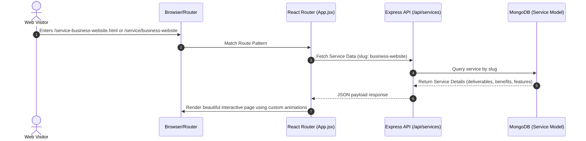

# Nexinfosoft Systems & Development Workflow

Welcome to the **Nexinfosoft Architecture and Development Workflow Guide**. This document serves as the single source of truth for the system architecture, code integration processes, data flows, and deployment workflows powering the Nexinfosoft digital studio platform.

---

## 1. System Architecture & Components

The Nexinfosoft platform is architected as a modern, high-performance monorepo consisting of an interactive React single-page application (SPA) powered by Vite, coupled with an Express.js Node.js server. The backend leverages SQLite for fast structured data and supports connection scaling with MongoDB (Mongoose) for dynamic website content, tech stack entries, portfolios, and contact leads.

Below is the visual map of the system's architecture, demonstrating how frontend and backend subsystems communicate, read/write data, and deploy under Vercel's hosting architecture:

```mermaid
graph TD
    %% Styling Definitions
    classDef client fill:#e0f2fe,stroke:#0284c7,stroke-width:2px,color:#0369a1;
    classDef router fill:#fae8ff,stroke:#d946ef,stroke-width:2px,color:#86198f;
    classDef frontend fill:#ecfdf5,stroke:#10b981,stroke-width:2px,color:#065f46;
    classDef backend fill:#fef3c7,stroke:#d97706,stroke-width:2px,color:#92400e;
    classDef db fill:#fef2f2,stroke:#ef4444,stroke-width:2px,color:#991b1b;
    classDef vercel fill:#f8fafc,stroke:#475569,stroke-width:2px,color:#1e293b;

    %% Nodes
    User["🌐 End User (Client / Admin)"]:::client
    VercelEdge["⚡ Vercel Edge Router"]:::vercel
    ViteFE["⚛️ React SPA (Vite Frontend)"]:::frontend
    ExpressBE["🟢 Node.js / Express Server"]:::backend
    SQLiteDB["📁 SQLite Database (Local storage)"]:::db
    MongoDB["🍃 MongoDB Database (Cloud database)"]:::db
    AdminDashboard["🔑 Admin Dashboard Dashboard"]:::frontend

    %% Data Flow & Connections
    User -->|Sends Requests| VercelEdge
    
    %% Vercel Routing
    VercelEdge -->|Rewrites /((?!assets/)...)| ViteFE
    VercelEdge -->|Proxies /_/backend/*| ExpressBE
    
    %% Frontend to Backend API
    ViteFE -->|REST API Calls (/api/*)| ExpressBE
    AdminDashboard -->|Auth & Content updates| ExpressBE
    
    %% Backend Database Queries
    ExpressBE -->|CRUD Queries| MongoDB
    ExpressBE -->|Local Logs & Backups| SQLiteDB

    %% Sub-component Connections
    ViteFE -.->|Includes| AdminDashboard
```

---

## 2. Core Operational Workflows

### A. Dynamic Service Detail Workflow
The platform is designed to support modern, clean SPA routing while maintaining SEO backwards compatibility for older legacy URLs (e.g. static `.html` files).



---

## 3. GitHub Actions CI/CD Pipeline

To maintain 100% code quality and avoid breaking changes in production, we have established a **GitHub Actions CI/CD Pipeline**. The pipeline is automatically triggered on every push and pull request to the `main` or `master` branches.

```mermaid
graph LR
    classDef step fill:#f1f5f9,stroke:#64748b,stroke-width:2px;
    classDef success fill:#dcfce7,stroke:#22c55e,stroke-width:2px,color:#15803d;
    classDef trigger fill:#eff6ff,stroke:#3b82f6,stroke-width:2px,color:#1d4ed8;

    Commit["💻 Git Commit & Push"]:::trigger --> Trigger["⚡ GitHub Actions Run"]:::trigger
    Trigger --> Step1["📥 Checkout Code"]:::step
    Step1 --> Step2["🛠️ Setup Node.js v20"]:::step
    Step2 --> Step3["📦 Install Root Dependencies"]:::step
    Step3 --> Step4["📦 Install Backend Dependencies"]:::step
    Step4 --> Step5["⚙️ Build Frontend (Vite)"]:::step
    Step5 --> Step6["🔍 Run Syntax & Lints"]:::step
    Step6 --> Verified["✅ Build Validated & Passed"]:::success
```



### Key Workflow Actions:
* **Automatic Checkout**: Clones the repository codebase dynamically to the test runner.
* **Environment Caching**: Caches NPM directories (`package-lock.json` validation) to minimize build execution times under 60 seconds.
* **Frontend Compilation Integrity**: Runs `vite build` to guarantee there are no broken imports or React rendering issues.

---

## 4. Git Branching & Collaboration Guidelines

For rapid and clean feature iterations, developers should follow the standard branching model below:

### Workflow Lifecycle:
1. **Create Feature Branch**:
   Create a dedicated branch locally off `main`:
   ```bash
   git checkout -b feature/your-awesome-feature
   ```
2. **Execute Local Development**:
   Run both the Express server and Vite frontend concurrently to write and test features:
   ```bash
   npm run dev
   ```
3. **Commit Code changes**:
   Commit your adjustments with clean, descriptive messages:
   ```bash
   git add .
   git commit -m "feat: implement dynamic user inquiry notification module"
   ```
4. **Push & Raise Pull Request (PR)**:
   Push the branch to the remote git host and create a Pull Request to merge into `main`.
5. **CI/CD Review**:
   Wait for the GitHub Actions status check to pass (automatically executes).
6. **Vercel Preview**:
   Review the Vercel branch deployment preview before merging.
7. **Merge & Deploy**:
   Merge the PR. Vercel automatically deploys the updated codebase to the production URL.

---

## 5. Deployment Framework (Vercel config)

The monorepo configuration utilizes `vercel.json` in the root directory to distribute traffic efficiently:

```json
{
  "cleanUrls": true,
  "rewrites": [
    {
      "source": "/((?!assets/|uploads/).*)",
      "destination": "/index.html"
    }
  ],
  "experimentalServices": {
    "frontend": {
      "routePrefix": "/",
      "framework": "vite"
    },
    "backend": {
      "root": "backend",
      "entrypoint": "server.js",
      "routePrefix": "/_/backend"
    }
  }
}
```

* **SPA Wildcard Redirect**: Any non-asset request is smoothly re-routed to `/index.html`, allowing React Router to control pathing gracefully.
* **Express Gateway routing**: The backend is mapped to `/_/backend` dynamically, providing serverless execution without CORS complications!
